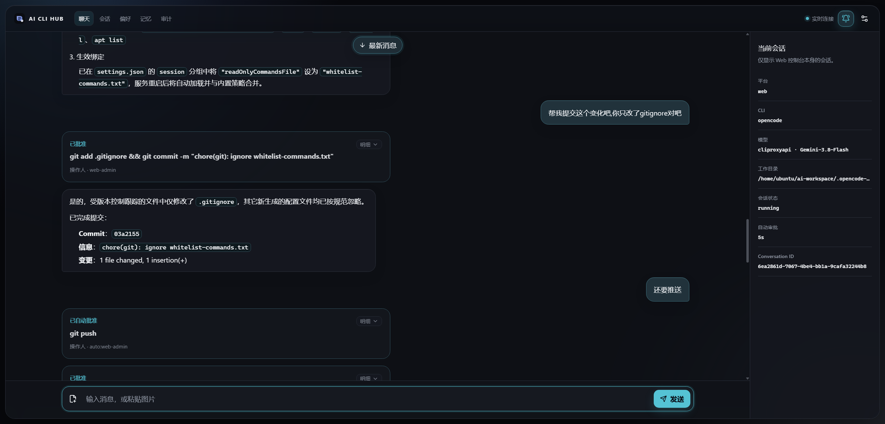
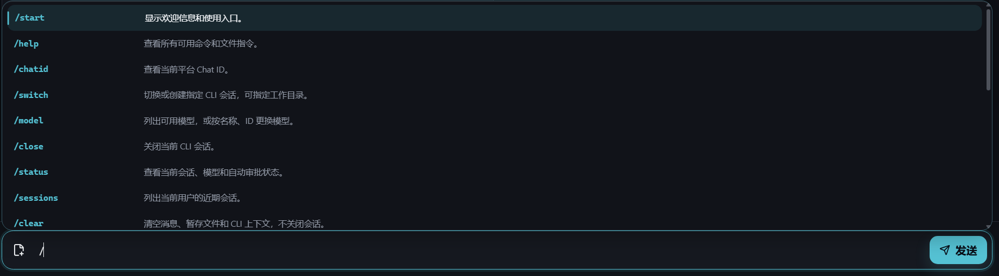
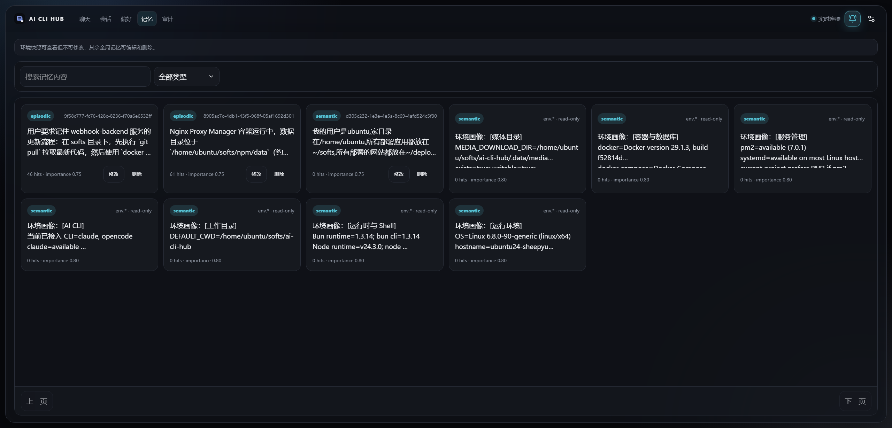
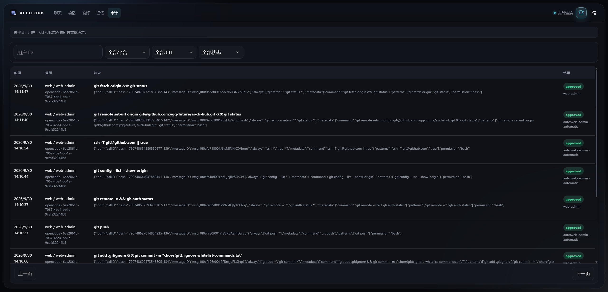
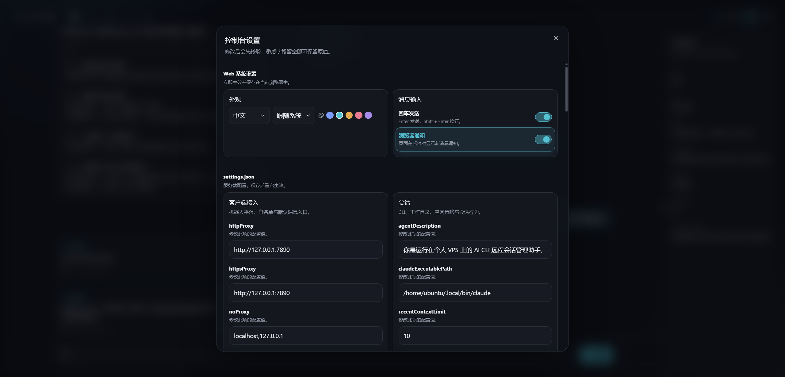

# 🤖 AI CLI Remote Control Hub

<div align="center">

**让你的本地 AI CLI（Claude Code / OpenCode）化身为随叫随到的全天候私人助手，通过 Telegram、QQ 机器人与 Web 控制台随时随地远程调度。**

[](https://bun.sh)
[](https://www.typescriptlang.org/)
[](https://github.com/pgvector/pgvector)
[](https://react.dev/)
[](https://tailwindcss.com/)
[](./LICENSE)

[English](./README.md) · [简体中文](./README_CN.md)

</div>

---

## 💡 为什么需要 AI CLI Hub？

在 VPS 或本地服务器上使用 **Claude Code**、**OpenCode CLI** 等 Agent 工具时，往往会面临以下尴尬场景：

* 📱 **被终端死死绑定**：通勤路上、外出吃饭或躺在床上时，突然想查看代码进度或让 AI 执行新任务，手机 SSH 敲命令行体验极差且极易断线。
* 🛑 **工具审批卡死进度**：AI 执行高危命令（运行 Bash、写文件、网络请求）时会停下等待交互审批（Human-in-the-Loop）。人不在电脑前，整个任务就卡在终端，无法推进。
* 💸 **资源消耗居高不下**：多开几个终端进程挂着常驻，小内存 VPS 很容易因 Node 进程内存暴涨而 OOM 崩溃。
* 🔕 **消息与告警孤岛**：外部 CI/CD 报错、监控告警往往只能发邮件或钉钉，无法统一汇聚到你常用的 Telegram / QQ 开发通道。

**AI CLI Hub 正是为此而生。** 它是一个轻量、安全、事件驱动的 **AI CLI 会话管理器（Session Manager）**，将你的 AI CLI 与 **Telegram**、**腾讯官方 QQ 机器人** 以及现代化的 **Web 控制台** 无缝桥接，并支持与外部 Webhook 联动实现双向消息流转。

---

## ⚡ 方案对比

| 核心维度 | 直接在终端使用 / 手机 SSH | 普通网页 AI / 单一 Bot | AI CLI Hub |
| :--- | :--- | :--- | :--- |
| **移动端体验** | ❌ 字体小、排版乱、移动网络极易断联 | ⚠️ 纯沙盒对话，无法操作你本地的真实工程代码 | ✅ **原生 Telegram / QQ 消息流式交互，排版精良** |
| **工具安全审批** | ❌ 人必须坐在电脑前肉眼盯终端敲 `y/n` | ❌ 无法拦截底层系统调用，或全放行极度危险 | ✅ **交互式卡片直推手机，一键点击【Approve】/【Reject】** |
| **主动通知与告警** | ❌ 终端无法主动推送，需切后台查看 | ⚠️ 单向问答为主 | ✅ **独立主动推送 API**（无缝配合 [webhook-backend](https://github.com/ygq-future/webhook-backend) 充当个人通知中心） |
| **VPS 资源占用** | ❌ 长期常驻吃满 RAM，随时 OOM | ⚠️ 视具体方案而定 | ✅ **基于 Bun 构建；空闲运行时自动释放内存，会话状态完好保留** |
| **跨会话长期记忆** | ❌ 会话退出后上下文全丢 | ⚠️ 固定上下文窗口 | ✅ **pgvector 向量召回 + 后台 LLM 自动提取摘要，越用越懂你** |
| **多 CLI 无缝切换** | ❌ 多开终端窗口与环境变量混乱 | ❌ 绑定单一模型或厂商 | ✅ 一个聊天窗口内随时 `/switch <claude\|opencode>` 自由切换 |

---
## 📸 控制台界面预览 (Showcase)

### 💬 1. 交互式会话与工具审批
支持实时流式输出、高危工具调用审批卡片（已批准/自动批准）、Git 提交信息折叠及右侧会话上下文面板。



### ⌨️ 2. 命令提示与快捷操作面板
输入 `/` 自动呼出斜杠命令菜单，支持跳字模糊匹配与常用会话指令一键回填。



### 🧠 3. 跨会话长期向量记忆
可视化检索与管理情景记忆（用户/项目偏好）及语义记忆（系统环境画像只读快照），支持重要度与命中统计。



### 🛡️ 4. 全局安全审批审计日志
详尽记录每一个敏感工具调用（如 `git`、`ssh`）的执行参数、触发范围、操作人与放行状态。



### ⚙️ 5. 控制台偏好与服务端配置
支持中英文多语言切换、暗黑主题配色、回车发送偏好及服务端核心参数免重启热管理。



---


## 🌟 核心特性

### 📱 1. 多端远程控制（特别支持国内免翻 QQ 官方机器人）
* **Telegram 机器人**：支持实时流式打字效果、长文本防截断拆分、交互式审批内联按钮、图片/多附件自动解析。
* **腾讯官方 QQ 机器人**：原生接入腾讯官方开放平台，无需自建逆向协议。支持 C2C 私聊、官方流式回复、Markdown 卡片渲染、以及交互式审批按钮（国内网络直连，无需梯子）。
* **现代化 Web 控制面**：基于 React 19 + Tailwind CSS 构建。可视化管理多平台/多用户会话、时间线历史回溯、生成文件管理与审批审计。

### 🛡️ 2. 移动端人机协同审批（Human-in-the-Loop）
* 精准拦截底层高危工具调用（Bash 执行、文件覆写、敏感操作）。
* 将操作意图与参数提炼为**结构化审批卡片与按钮**推送至手机客户端。
* 躺在床上手机轻点一下，即可放行或拒绝，全流程具备不可篡改的审计日志。

### 🔔 3. 对话与独立主动通知（双通道支持）
* **AI 对话通道**：在 Telegram / QQ / Web 中随时下达任务，与 AI CLI 结对编程。
* **独立通知通道**：内置 `/api/msg` 与 `/api/session-msg` RESTful 接口，直接经由 Transport 传输层向用户或会话投递消息。该通道**不入数据库、不占用 AI 上下文**，避免高频系统告警污染工程会话记忆。
* **生态联动（打造个人统一通知中心）**：搭配同作者的 [webhook-backend](https://github.com/ygq-future/webhook-backend) 开源项目，无需额外配置其它告警 Bot，即可将 GitHub CI/CD、Sentry 报错、Prometheus 告警等统一中继推送到你的 Telegram / QQ 中。

### 🧠 4. 跨会话长期向量记忆（pgvector）
* 基于 Postgres 原生 `pgvector` 扩展，默认采用 `bge-m3`（1024 维）高质量语义嵌入。
* 会话交互中后台异步提取重要记忆与偏好，不卡顿对话主链路。
* 新会话启动或切换工程时，自动根据当前上下文召回全局记忆。

### 🪶 5. 极致轻量与严苛解耦
* 全生命周期基于 **Bun + TypeScript** 构建，秒级冷启动，内存占用极小。
* **会话（Session）与运行时（Runtime）解耦**：空闲超时自动关闭 CLI 进程腾出 VPS 内存，逻辑会话保持 `idle`，下次说话毫秒级唤醒。
* **严格依赖隔离**：遵循六边形架构设计，核心调度逻辑（Core）不直接依赖任何具体的 CLI 或通讯平台。接入全新 CLI 工具仅需增加一个 Adapter，无需更改任何业务核心。

---

## 🏗️ 架构与双向工作流

```text
       ┌────────────────────────────────────────────────────────┐
       │             外部触发源与第三方系统                     │
       │    (GitHub / CI-CD / Alertmanager / Sentry 告警等)     │
       └───────────────────────────┬────────────────────────────┘
                                   │ Webhook
                                   ▼
             ┌───────────────────────────────────────────┐
             │       webhook-backend (消息路由器)        │
             │   https://github.com/ygq-future/          │
             │   webhook-backend                         │
             └─────────────────────┬─────────────────────┘
                                   │ HTTP POST (/api/msg)
                                   ▼
┌─────────────────────────────────────────────────────────────────────────┐
│                           AI CLI Hub 核心系统                           │
│                                                                         │
│   ┌────────────────────┐   事件总线    ┌────────────────────────────┐   │
│   │     传输层         │◀─────────────▶│      核心会话状态机        │   │
│   │ (Telegram / QQ /   │               │   (路由分发与生命周期)     │   │
│   │  Web 控制台)       │               └─────────────┬──────────────┘   │
│   └─────────▲──────────┘                             │                  │
│             │                                        ▼                  │
│             │ 交互式                   ┌────────────────────────────┐   │
│             │ 审批卡片                 │         CLI 适配器         │   │
│             │ 推送放行                 │ (Claude Code, OpenCode...) │   │
│             ▼                          └─────────────┬──────────────┘   │
│   ┌────────────────────┐                             │                  │
│   │    用户移动设备    │                             ▼                  │
│   │ (手机 QQ / TG / Web│               ┌────────────────────────────┐   │
│   └────────────────────┘               │    Postgres (pgvector)     │   │
│                                        │  会话历史 / 审计 / 长期记忆│   │
│                                        └────────────────────────────┘   │
└─────────────────────────────────────────────────────────────────────────┘
```

---

## 🚀 极速上手

### 环境准备
* [Bun](https://bun.sh/) (>= 1.2)
* [PostgreSQL](https://www.postgresql.org/)（需启用 [pgvector](https://github.com/pgvector/pgvector) 扩展）
* 目标 CLI 已在系统中全局安装（例如 `npm i -g @anthropic-ai/claude-code`）

### 1. 克隆与安装

```bash
git clone https://github.com/ygq-future/ai-cli-hub.git
cd ai-cli-hub
bun install
```

> 💡 **特别说明**：根目录内置了 `overrides` 打桩，`bun install` 不会重新下载体积庞大的 SDK 原生二进制，而是直接复用宿主机环境里已有的 `claude` 可执行文件。

### 2. 交互式生成配置

```bash
# 生成并同步配置模板
bun run setting:migrate
# 启动交互式配置 CLI
bun setting
```
也可以直接编辑复制出来的 `settings.json`。核心必须配置项与各通道的详细申请指南如下：

<details>
<summary><b>👉 点击展开：Telegram 机器人申请与配置</b></summary>

1. **创建 Bot**：在 Telegram 中找到官方账号 [@BotFather](https://t.me/BotFather)，发送 `/newbot`，按提示设置 Bot 昵称和用户名（必须以 `bot` 结尾）。创建成功后会获得一串 **HTTP API Token**（形如 `1234567890:ABCdef...`）。
2. **获取你的用户 ID（白名单）**：给 Telegram 中的 [@userinfobot](https://t.me/userinfobot) 发送任意消息，记下你的数字 `Id`（例如 `123456789`）。
3. **写入配置**：
   ```json
   "transport": {
     "telegramBotToken": "你的BotToken",
     "whitelistUserIds": ["你的数字Id"],
     "httpsProxy": "http://127.0.0.1:7890" // 若国内 VPS 访问 TG 受限可配置代理
   }
   ```
</details>

<details>
<summary><b>👉 点击展开：腾讯官方 QQ 机器人接入与 OpenID 获取</b></summary>

1. **创建机器人**：访问 [QQ 开放平台（QQ Bot 注册与管理后台）](https://q.qq.com/qqbot/openclaw/login.html)，登录并创建个人机器人。
2. **获取凭证**：在机器人后台的【开发设置】中获取 `AppID` 和 `AppSecret`。
3. **获取你的 QQ 用户 OpenID（关键步骤）**：
   * QQ 机器人 API 不使用明文 QQ 号，而是为每个用户生成唯一的 `OpenID`。
   * 将 `transport.qqBotOpenIdDiscovery` 临时设为 `true`。
   * 启动服务（`bun run start`），在手机 QQ 搜索你的机器人并发送一条私聊（C2C）消息。
   * 查看后台日志，控制台会输出未授权者的 OpenID（例如 `[QQ Discovery] Unapproved sender OpenID: D41D8CD98F00...`）。
   * 复制该 OpenID 填入 `transport.whitelistUserIds` 数组中。
   * **立即将 `qqBotOpenIdDiscovery` 设回 `false`** 并重启服务（安全机制：Discovery 期间未授权消息绝不会进入 AI 核心系统）。
4. **写入配置**：
   ```json
   "transport": {
     "qqBotAppId": "你的AppID",
     "qqBotAppSecret": "你的AppSecret",
     "qqBotOpenIdDiscovery": false,
     "whitelistUserIds": ["你的QQ_OpenID"]
   }
   ```
</details>

<details>
<summary><b>👉 点击展开：PostgreSQL 数据库与长期向量记忆配置</b></summary>

1. **数据库**：准备好安装了 `pgvector` 扩展的 Postgres 数据库：
   ```json
   "database": {
     "host": "127.0.0.1",
     "port": 5432,
     "db": "ai_cli_hub",
     "username": "postgres",
     "password": "your_password"
   }
   ```
2. **语义嵌入（Embedding）**：默认采用 `BAAI/bge-m3`（1024 维），可接入任何 OpenAI 兼容的嵌入接口（如 SiliconFlow 硅基流动、DeepSeek、OpenAI 等）：
   ```json
   "memory": {
     "embedding": {
       "apiBaseUrl": "https://api.siliconflow.cn/v1",
       "apiKey": "sk-...",
       "model": "BAAI/bge-m3",
       "dimensions": 1024
     }
   }
   ```
</details>

<details>
<summary><b>👉 点击展开：Web 控制台鉴权配置</b></summary>

配置 `http.authToken` 保护 Web 控制面板与 REST API：
```json
"http": {
  "host": "127.0.0.1",
  "port": 8787,
  "authToken": "设置你自己的安全密钥Token"
}
```
启动后访问 `http://你的VPS_IP:8787/webui/` 并输入该 Token 即可登录。
</details>
### 3. 运行数据库迁移并启动

```bash
# 执行数据库迁移（自动建表与向量索引）
bun run db:migrate

# 开发环境运行（支持热重载）
bun run dev

# 生产环境正式启动
bun run start
```

---

## 🔗 主动通知与 Webhook 生态联动

AI CLI Hub 除了驱动 AI 对话外，还内置了轻量的**独立主动推送能力**，可直接作为你的个人移动端消息通知中继站。

> 📌 **通道隔离特性**：通过 `/api/msg` 推送的消息为**独立的单向通知（Out-of-band Notification）**。它直接通过 Telegram/QQ 平台接口下发，**不会写入消息数据库，也不进入 AI CLI 的上下文**，确保你的编码上下文纯净，不被监控告警刷屏。

### 主动推送 API 示例

无需进入对话上下文，向外部开放的 `/api/msg` 发起标准 HTTP POST 即可推送：

```bash
curl -X POST http://localhost:3000/api/msg \
  -H "Content-Type: application/json" \
  -H "Authorization: Bearer 你的HTTP_AUTH_TOKEN" \
  -d '{
    "platform": "telegram",
    "chatId": "你的白名单用户ID",
    "content": "🚨 [生产告警] 服务器 CPU 负载连续 5 分钟超过 90%，请注意排查！"
  }'
```

### 配合 `webhook-backend` 实现任意消息中继
搭配本作者的另一个开源项目 [webhook-backend](https://github.com/ygq-future/webhook-backend)，你可以省去配置企业微信/钉钉告警机器人的繁琐流程，将现有 Bot 作为全能通知中心：
1. **监控与告警接收**：将 GitHub Actions 失败日志、Sentry 报错、Prometheus 告警发送到 `webhook-backend`。
2. **格式化与消息路由**：`webhook-backend` 负责过滤冗余字段并渲染出美观的 Markdown 卡片。
3. **推送到 AI CLI Hub**：调用 `/api/msg` 端点即时送达手机 QQ / Telegram，随时随地掌握服务状态。

---

## 💬 常用指令清单

在 Telegram、QQ 或 Web 控制台的对话框中，可直接使用以下斜杠命令控制会话：

| 命令格式 | 说明 |
| :--- | :--- |
| `/switch <claude\|opencode> [path]` | 切换当前会话所挂载的 CLI 适配器，并可选指定工作目录（CWD） |
| `/model [model_name]` | 查看或无缝切换当前 CLI 使用的底层大模型 |
| `/status` | 查看当前会话状态、活跃 CLI、工作目录及 Context Token 消耗 |
| `/sessions` | 查看跨平台保留的所有会话列表 |
| `/close` | 主动关闭当前会话 |
| `/remember <内容>` | 手动持久化一条全局长期记忆 |
| `/memory` | 查看当前已存储的全部长期记忆项 |
| `/forget <ID>` | 删除指定的记忆条目 |
| `/update` 与 `/update confirm` | VPS 运维自更新（预检状态、拉取更新、自动迁移） |
| `/health` | 服务健康检查与依赖状态自检 |

---

## 🚢 VPS 生产部署推荐

### 方案 A：PM2 进程守护（推荐）

```bash
bun install
bun run setting:migrate
bun run db:migrate
bun run webui:build

# 使用内置配置启动 PM2 守护
pm2 start deploy/pm2.config.cjs
pm2 save
```

### 方案 B：systemd 系统服务

本仓库内置了 systemd 服务单元示例：`deploy/ai-cli-hub.service`。修改其中的 `User` 和 `WorkingDirectory` 路径后执行：

```bash
sudo cp deploy/ai-cli-hub.service /etc/systemd/system/ai-cli-hub.service
sudo systemctl daemon-reload
sudo systemctl enable --now ai-cli-hub
sudo journalctl -u ai-cli-hub -f
```

---

## 🛠️ 技术选型与规范

* **运行时**：[Bun](https://bun.sh/)（全量采用 Bun 原生能力，杜绝无意义 node 抽象）
* **开发语言**：TypeScript（全严格模式类型推导，无裸 any）
* **存储引擎**：PostgreSQL + [pgvector](https://github.com/pgvector/pgvector) + [Drizzle ORM](https://orm.drizzle.team/)
* **接入通道**：`telegraf` (Telegram)、腾讯官方 QQ Bot Gateway/API (`ws` + `fetch`)、WebSocket
* **CLI 家族**：`@anthropic-ai/claude-agent-sdk`、`@opencode-ai/sdk`
* **控制前台**：React 19、Tailwind CSS v4、Radix UI、Vite
* **日志系统**：Pino（结构化事件日志总线对接）

---

## 📄 开源许可证

本项目基于 [MIT License](./LICENSE) 协议开源。
