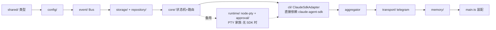
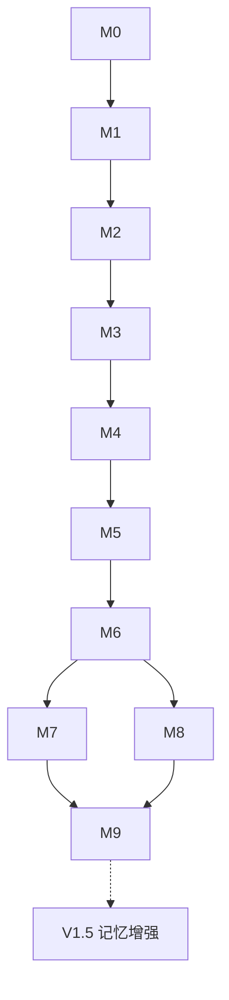

# 05 - 实施计划（Implementation Plan）

> vibe coding 的**施工图**：定义构建顺序、里程碑、每步交付物与验收标准。
> 编码 Agent 请**严格按里程碑顺序推进**，每个里程碑通过验收后再进入下一个。
> 契约见 [03](./03-Interface-Contracts.md)，数据见 [04](./04-Data-Model.md)，规矩见 [CLAUDE.md](../CLAUDE.md)。

---

## 1. 构建顺序（依赖拓扑）

**从叶子到根，从抽象到装配。** 违反此序会导致上层无桩可依、反复返工。

> 原则：**下游未就绪不动上游**。例如 Transport（I）依赖 Core（E）与 Aggregator（H）已可用。

---

## 2. 里程碑

### M0 — 工程骨架 ✅ 交付即可编译运行空壳

- 初始化 Bun + TS（strict）+ `package.json` 脚本（见 CLAUDE.md §6）。
- 目录骨架（`src/*` 空模块 + `index.ts`）。
- ESLint + `dependency-cruiser`（落地依赖矩阵铁律）+ Pino 基础 logger。
- `.env.example`（见 [07 附](./07-Command-UX.md)）。
- **验收**：`bun run typecheck` / `bun run lint` 通过；`bun run dev` 启动打印一行日志退出。

### M1 — 配置与事件总线

- `config/`：`ConfigSchema` + `loadConfig()`，fail-fast。
- `event/`：`EventBus` 实现 + 完整 `EventMap`。
- `logger/`：订阅全部事件结构化输出。
- **验收**：单测——非法 env 抛错；`emit`/`on` 类型安全且送达；logger 能打出任一事件。

### M2 — 存储与仓储

- `storage/`：Drizzle 连接 + 四表 schema（[04](./04-Data-Model.md)）+ 迁移 0001（含 `CREATE EXTENSION vector`，不含 HNSW）。
- `repository/`：四个 Repository 实现（`embedding` 相关方法先留桩/关键词版）。
- **验收**：跑迁移建库成功；集成测试对每个 Repository 增查通过；**全项目仅 `repository/` 出现 SQL**（lint 校验）。

### M3 — Core 状态机与会话生命周期

- `core/`：`SessionManager`（状态机，合法迁移见 02-架构 §5.2）、`Auth`（白名单二次校验）、`MessageRouter`。
- 会话边界：`findActive(user,cli,cwd)` 复用 / `/new` 新建 / 归档扫描。
- 进程占位：先用 **MockRuntime** 打通"收消息→路由→存库→回消息"闭环。
- **验收**：状态机单测覆盖全部合法/非法迁移；用 Mock 打通端到端（无真实 PTY）；进程回收→会话转 `idle` 而非 `closed`。

### M4 — Claude Adapter（SDK 家族，首选）

- `cli/`：`ClaudeSdkAdapter` 实现 `CLIAdapter`（§3.1），内部持 `@anthropic-ai/claude-agent-sdk` 的 `query()` 句柄。
  - `sendUserInput` → 流式输入（`AsyncIterable<SDKUserMessage>` / `streamInput`）；`onOutput` ← `SDKMessage`（assistant/tool_use/result）。
  - **审批走 `canUseTool` 回调**：拿到工具名+参数 → `onApprovalRequest` → `bus.emit('ApprovalRequested')`；`resolveApproval(id,'approve'|'reject')` → `resolve({behavior:'allow'|'deny'})`。**无 scraping、无 `Runtime`、无 `ApprovalDetector`。**
  - 生命周期：子进程起止/崩溃 → `onExit` → `PTYStarted/PTYExited` 事件；`PTY_IDLE_TIMEOUT_MS` 空闲杀进程（`query.interrupt()`/close），会话转 `idle`。
- **验收**：真实拉起 Claude 完成一轮对话；构造一次工具审批，`canUseTool` 命中 → 收到结构化 `command`+`detail`；点 Approve 继续、Reject 拒绝；空闲超时进程被回收、会话可唤醒。

### M4b — PtyRuntime（PTY 家族，无 SDK 的 CLI 备用，可延后）

- `runtime/`：`NodePtyRuntime` 实现 `PtyRuntime`（§3.2，字节容器）。
- `approval/`：某无 SDK 的 CLI 的 `ApprovalDetector`（正则 `[Y/n]` scraping）。
- `cli/`：`XxxPtyAdapter` 实现同一 `CLIAdapter`，内部剥 ANSI 得输出、scraping 认审批、写 `y\r`/`n\r`。
- **验收**：无 SDK 的目标 CLI 也能经统一 `CLIAdapter` 完成一轮对话与一次审批。**非 V1 关键路径**——V1 只跑 Claude（SDK），本节按需推进。

### M5 — 消息聚合器

- `MessageAggregator`：Buffer + Debounce + Throttle + Markdown 合并 + 超长拆分。
- **验收**：高频 chunk 注入下，`MessageGenerated` 发射频率 ≤ `minEditIntervalMs`；超 4096 字符自动分段；静默后 flush 完整。

### M6 — Telegram Transport（首个端到端）

- `transport/telegram`：Telegraf 封装，实现 `Transport` 全方法。
- 白名单前置丢弃；流式 `editMessage`；审批 Markdown 卡片 + 回调 → `ApprovalApproved/Rejected`。
- **验收**：真机 Telegram 端到端——发消息得流式回复；点 Approve 继续（SDK: `resolveApproval` allow）；点 Reject 中断；非白名单无响应。

### M7 — Audit 落地

- 订阅 `ApprovalApproved/Rejected` → `AuditRepository.record`（时间/操作人/命令/决策）。
- **验收**：每次审批必产生一条不可删审计；会话归档后审计仍在。

### M8 — 记忆基础（V1：关系 + FTS 回放）

- `memory/`：订阅 `MessageGenerated` → 异步生成 episodic 摘要 + semantic/preference 抽取（**不含向量**，`embedding` 留空）。
- 召回：新会话按 `user_id` 取 user-level + FTS 关键词 Top-K 注入上下文。
- 归档时生成会话摘要。
- **验收**：跨会话——新会话能带出上一会话摘要与用户偏好；后台任务失败不阻塞对话。

### M9 — 加固与交付

- 优雅关闭（SIGTERM：停入站→flush→杀 Runtime→关 DB）；故障隔离（单 Runtime 崩溃不波及他会话）；幂等审批去重。
- PM2/systemd 部署脚本；README。
- **验收**：压测多会话不串扰；重启无脏状态；PRD §8 交付清单全绿。

### —— V1.5（记忆增强，非 V1 阻塞项）——

- 迁移追加 HNSW 索引；`memory/` 接入嵌入 API（异步批量）回填 `embedding`。
- 召回切换/融合 `searchByVector`（相似度 × importance 重排）。
- 遗忘：按 `importance × last_accessed` 定期降权/清理。
- **验收**：语义模糊 query 能召回关键词对不上的相关记忆；召回质量优于纯 FTS。

---

## 3. 里程碑依赖与并行

- **可并行**：M5（聚合器，依赖 M4 的 chunk 但接口独立）与 M4 后段可交叠；M8 可在 M6 完成后与 M7 并行。
- **关键路径**：M0→M1→M2→M3→M4→M6→M9。

---

## 4. vibe-coding 工作流约定

1. **每个里程碑一个分支/一批提交**，完成"验收"再合并。
2. **契约先行**：动实现前对齐 [03](./03-Interface-Contracts.md)；若需改签名，先改 03 再改实现，保持真相源唯一。
3. **测试随行**：难测部件（PTY/事件/审批）先写 Mock 与断言（M3 的 MockRuntime 贯穿始终）。
4. **每步自检三问**：违反依赖矩阵了吗？出现 `process.env`/SQL 越界了吗？状态迁移合法吗？
5. **发现要改 Core 才能加功能 → 停**，回看架构分层，多半是设计问题。

---

## 5. V1 完成定义（Definition of Done）

对齐 [PRD §8](./01-PRD.md) 交付清单：

- ✅ Bun+TS 架构 / Postgres+Drizzle+Repository / Event Bus / Config
- ✅ Telegram 接入 / Claude Adapter（`@anthropic-ai/claude-agent-sdk`，SDK 家族）/ 状态机会话生命周期
- ✅ Message Aggregator / Approval Flow / 永久 Audit
- ✅ 会话边界（cwd 复用 / `/new` / `/close` / 归档）
- ✅ 记忆基础：跨会话摘要回放（向量列预留待 V1.5）
- ✅ 全程满足依赖矩阵、无 env/SQL 越界、优雅关闭
