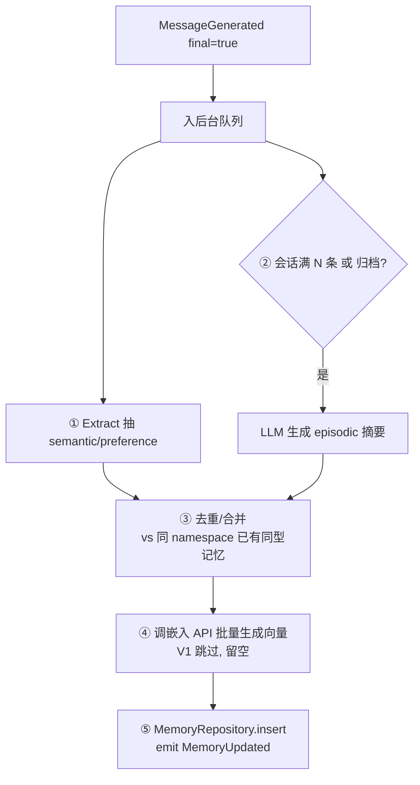
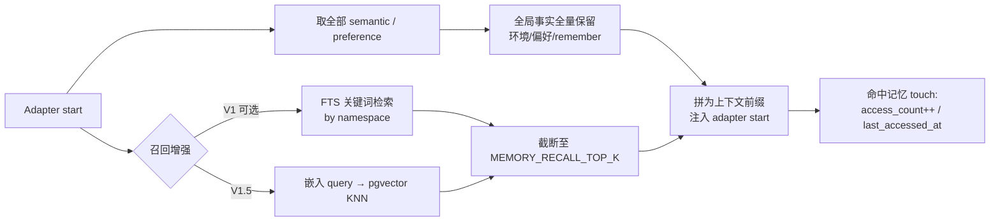

# 06 - 长期记忆设计（Memory Design）

> 展开 [02-架构 §7](./02-Architecture.md) 为可实现的详细设计。表结构见 [04](./04-Data-Model.md)，接口见 [03 §5](./03-Interface-Contracts.md)。
> 定位：让系统**跨会话记住实例环境、全局事实与项目上下文**，且**零侵入对话主链路**。
> 落地节奏：**V1 环境快照记忆优先 + 命令式全局记忆** → **V1.5 pgvector 语义召回**（见 [05](./05-Implementation-Plan.md)）。

---

## 1. 设计原则

1. **异步、不阻塞**：记忆的写入（抽取/摘要/嵌入）全部在对话回复之后后台进行，失败重试，绝不拖慢用户收发。
2. **归属解耦**：Transport 的 `user_id` 只用于鉴权、会话隔离和审批操作者；长期记忆属于当前个人 VPS / AI Hub 实例的共享 `namespace`，不按 Telegram/QQ/WebSocket 用户 ID 切分。V1 先做实例级显式记忆与环境事实；conversation messages 当前不做完整回放，只在 adapter 重启后的下一条 user message 中补最近 `RECENT_CONTEXT_LIMIT` 条轻量上下文。
3. **独立于短期记录**：不保存 `conversation_id` / `source_message_id`；消息清理不影响长期记忆。每条记忆保留重要度/访问统计，供后续衰减清理。
4. **嵌入走 API**：不在 VPS 跑本地模型；批量调用降低成本与延迟影响。

---

## 2. 实例级记忆模型

| 类型 | 锚点 | 内容 | 注入/召回 |
|---|---|---|---|
| `semantic` / `preference` | `namespace='global'` | 环境事实、全局偏好、手工 `/remember` 事实 | Adapter 启动时全量注入 |
| `episodic` | `namespace='global'` | 用户主动要求保存的对话摘要 | 仅按向量 Top-K 跨会话召回 |

**全局注入** = namespace 内全部 `semantic` / `preference`（含 environment），拼为 system hint 注入 adapter start，且**不受 `MEMORY_RECALL_TOP_K` 限制**。`episodic` 不全量注入，只参与向量召回。adapter 重启后，下一条 user message 仍会携带当前 conversation 最近 `RECENT_CONTEXT_LIMIT` 条轻量上下文。

> 因为这是个人 VPS 上的 AI Hub，同一个操作者可能来自 Telegram、QQ 或 WebSocket；这些渠道的 `user_id` 不应制造多套记忆。若未来需要多套人格/工作区，可扩展 `namespace`（如 `personal` / `work` / `client-a`），而不是复用平台用户 ID。

---

## 3. 记忆分型

| type | 生成时机 | 生成方式 | 典型内容 |
|---|---|---|---|
| `episodic`（情节） | 会话归档 / 滚动（后续） | LLM 摘要 | "这次会话做了什么、结论是什么" |
| `semantic`（事实） | `/remember` 或环境 upsert | 显式写入 / 系统探测 | "所有软件放在 softs 文件夹"、"当前系统是 Windows" |
| `preference`（偏好） | `/remember` | 显式写入 | "回复用中文"、"默认使用 Bun" |

---

## 4. 写入侧：V1 环境快照 + 命令式记忆

V1 不做隐式抽取，避免误判用户随口表述。写入入口按优先级推进：

- **M8-A 环境快照**：系统启动时 upsert 环境记忆。快照是按 OS 自适应的 VPS 运维画像：Linux 记录 OS/hostname/cwd、Bun/Node/Git、Shell、Claude/Codex/Gemini CLI、PM2、Docker/Compose、Postgres 工具、默认工作目录、媒体目录可操作状态与清理提示；不写入容器列表、端口、磁盘占用等易漂移状态，Agent 需要时自行执行实时命令查询。Windows 仅在实际存在时记录 PowerShell。
- **M8-C 命令式记忆**：`/remember <text>` 直接写入 `namespace='global'` 的 `semantic`；带 `preference:` / `偏好:` 前缀则写入 `preference`。
- **M8-D 环境刷新**：`/env` 手动刷新 `env.*` 稳定 tag 并展示当前环境快照，用于部署后补齐 PM2/Docker/媒体目录等运行态事实。
- **V1.5 自然语言记忆触发**：普通对话中用户表达“记住/记一下/记录/remember this”等意图时，Core 保存该用户消息后发 `MemorySummaryRequested`，不再交给 Claude SDK 处理，避免 SDK 自己写宿主 memory 文件。Memory 模块按 `MEMORY_REQUESTED_SUMMARY_MESSAGE_LIMIT` 读取当前 conversation 最近的 user/assistant 消息，调用 LLM summary API 生成一条 conversation-derived episodic 记忆；摘要输出语言跟随当前用户 `/lang`，长度上限由 `MEMORY_SUMMARY_MAX_CHARS` 控制，并要求第三人称或中性事实陈述，避免“你/我/我们/助手”等依赖当前对话身份的人称。
- 会话关闭不再自动生成记忆：`SessionClosed` 只负责会话/adapter 生命周期清理，不从最近消息做确定性摘录。长期会话记忆只在用户主动说“记住/记录/remember this”时触发 LLM 摘要，避免非 LLM 摘录把杂乱或不准确的信息写入长期记忆。

环境记忆必须按稳定 `tag` 幂等更新，不允许每次启动或 `/env` 重复插入同一事实。所有 probe 必须有短超时，失败只记录 missing/unknown，不阻塞 Telegram 主链路。

## 4.1 后续异步管线（V1.5/增强）



### 4.1 触发与节流
- 当前实现：仅用户主动表达“记住/记一下/记录/remember this”等记忆意图时生成 conversation-derived episodic 记忆。
- 当前摘要必须调用 LLM summary API，不做基于最近消息的确定性摘录，避免把杂乱或不准确的信息写入长期记忆。
- 后续如增加滚动阈值 `N`（如每 20 条消息），也必须走 LLM 摘要器，而不是直接拼接最近消息。

### 4.2 去重合并
- 新 `semantic/preference` 与同 `namespace` 已有同型记忆比对：
  - V1：文本归一化 + 关键字段匹配。
  - V1.5：向量相似度 > 阈值即视为同一记忆 → 更新而非新增，`importance` 累加。

### 4.3 嵌入（V1.5）
- 通过 `EMBEDDING_API_BASE_URL` 调用 OpenAI-compatible embeddings API，批量提交 `content` 到 `EMBEDDING_MODEL`，写回 `embedding`。
- 失败进重试队列，指数退避；**永不阻塞**主链路。
- 维度对齐 `vector(1024)`（默认 `BAAI/bge-m3`）。
- `/remember` 写入的 `semantic` / `preference` 在 adapter start 时全量注入，不参与 embedding 回填；embedding 只服务 `episodic`。

---

## 5. 召回侧：记忆注入

对话入站、进 CLI 之前插入一个"召回注入"钩子（[02 §4.1](./02-Architecture.md)）。



### 5.1 全局记忆注入格式（拼进 adapter system hint）
```text
[长期记忆 · 供参考]
- 偏好：回答简洁，用中文
- 项目事实：本仓库使用 Postgres + Drizzle
- 环境：当前运行在 Linux VPS，PM2 管理 ai-cli-hub，Docker 中有 pgvector/Postgres，媒体目录在 `/.../.data/media` 且可按时间清理
---
```

### 5.1.1 最近上下文补偿（拼进重启后的首条 user message）
```text
[最近对话上下文 · 供延续当前会话]
- 用户：上一条问题
- 助手：上一条回答
---
[本次用户输入]
{user text}
```

该上下文只在 adapter 刚启动时拼入 user message；adapter 已运行时，普通消息不重复携带历史。

### 5.2 参数
- `MEMORY_RECALL_TOP_K`（默认 10）：只限制关键词/向量检索出来的跨会话召回条数，防上下文膨胀。
- `RECENT_CONTEXT_LIMIT`（默认 10）：adapter 刚启动/重启时拼入当前 conversation 的历史消息条数。
- `RECENT_CONTEXT_MESSAGE_MAX_CHARS`（默认 1200）：最近上下文中单条历史消息的最大字符数；超出时保留尾部。
- `EMBEDDING_API_BASE_URL`（默认 `https://api.openai.com/v1`）：OpenAI-compatible embeddings API base URL。
- `EMBEDDING_MODEL`（默认 `BAAI/bge-m3`）与 `EMBEDDING_DIMENSIONS`（默认 1024）必须和数据库 `memories.embedding vector(1024)` 对齐；更换维度需要迁移列类型并重算 embedding。
- `MEMORY_SUMMARY_API_BASE_URL` / `MEMORY_SUMMARY_API_KEY` / `MEMORY_SUMMARY_MODEL`：OpenAI-compatible chat completions 摘要 API；自然语言记忆触发依赖它生成 LLM 摘要，留空时只发 `ErrorOccurred`，不阻塞对话。
- `MEMORY_REQUESTED_SUMMARY_MESSAGE_LIMIT`（默认 10）：用户主动“记住/记录”时，LLM 摘要读取最近多少条 user/assistant 消息。
- `MEMORY_SUMMARY_MAX_CHARS`（默认 600）：自然语言记忆摘要 prompt 的输出长度上限；摘要语言跟随当前用户 `/lang`。
- 实例级全局事实（环境快照、`/remember`、偏好）是稳定事实池，启动时全量注入，不参与 Top-K 截断，也不通过 embedding 重复召回。

---

## 6. 遗忘与衰减

记忆库必须有界，否则召回质量随规模下降。

当前 `importance` 是写入端的固定初始权重，不是模型实时评分：手工 `preference=0.85`、手工 `semantic=0.75`、用户主动生成的 `episodic=0.75`、环境事实默认 `0.8`（个别 probe 可显式覆盖）。目前全量注入和 pgvector KNN 不按该字段重排；它主要为后续遗忘/衰减策略预留，避免把“设计公式”误认为已上线行为。

- **评分**：`score = importance × decay(last_accessed_at) + freq(access_count)`
  - `decay` 随时间指数衰减；越久未访问权重越低。
  - 每次命中 `touch` 提升访问统计，形成"常用记忆浮上来"。
- **清理任务**（定时，V1.5）：
  - 低分且久未访问的 `semantic/preference` → 降权或删除。
  - `episodic` 可二次摘要压缩（多条旧情节 → 一条更高层摘要）。
- 实例级全局高 `importance` 事实/偏好设保护阈值，不轻易清理。

> V1 记忆量小，可暂不启用清理；随规模增长在 V1.5 引入。

---

## 7. 模块结构（`memory/`）

```text
memory/
├── index.ts          # createMemoryModule({ bus, repos, config })：订阅事件、装配
├── extractor.ts      # semantic/preference 抽取
├── summarizer.ts     # episodic 摘要（滚动/归档）
├── embedder.ts       # 嵌入 API 客户端（批量、重试）—— V1.5
├── recaller.ts       # 召回：FTS(V1) / vector(V1.5) + 重排 + 注入格式化
├── forgetting.ts     # 衰减评分与清理任务 —— V1.5
└── queue.ts          # 后台异步队列（失败重试，隔离主链路）
```

**依赖**：仅 `event/`, `repository/`, `shared/`, `config/`（见 [CLAUDE.md 依赖矩阵](../CLAUDE.md)）。**不依赖 `core/`**——完全通过事件协作，Core 无感知。

---

## 8. 与 Core 的交互（零侵入证明）

| 时机 | Memory 做什么 | Core 是否改动 |
|---|---|---|
| Adapter start | Orchestrator 或装配根调用注入的 `Recaller.recall()` 拿到前缀 | 否（注入接口，非 import 实现） |
| 回复生成后 | Memory 订阅 `MessageGenerated` 后台处理 | 否 |
| 会话归档 | `SessionClosed` 只做生命周期清理，不自动生成记忆 | 否 |

> 唯一"接触"是 Core 在路由时调用一个注入进来的 `Recaller` 接口做召回；实现体在 `memory/`，Core 只见接口。新增/替换记忆策略不动 Core。

---

## 9. V1 vs V1.5 对照

| 维度 | V1 | V1.5 |
|---|---|---|
| 存储 | Postgres（`embedding` 列留空） | 同库启用 pgvector + HNSW |
| 召回 | 实例级全局记忆全量取回 + FTS 关键词 Top-K | 向量语义 KNN + 相似度×importance 重排 |
| 嵌入 | 不调用 | API 批量异步回填 |
| 去重 | 文本归一化匹配 | 向量相似度阈值合并 |
| 遗忘 | 暂不启用 | 衰减评分 + 定时清理/压缩 |
| 能力 | "带出显式全局记忆与环境事实" | "语义模糊也能精准召回" |

> **一次定库、分阶段加能力**：数据库第一版即 Postgres；向量作为召回精度增强平滑接入，`MemoryRepository` 接口不变，Core 零改动。
