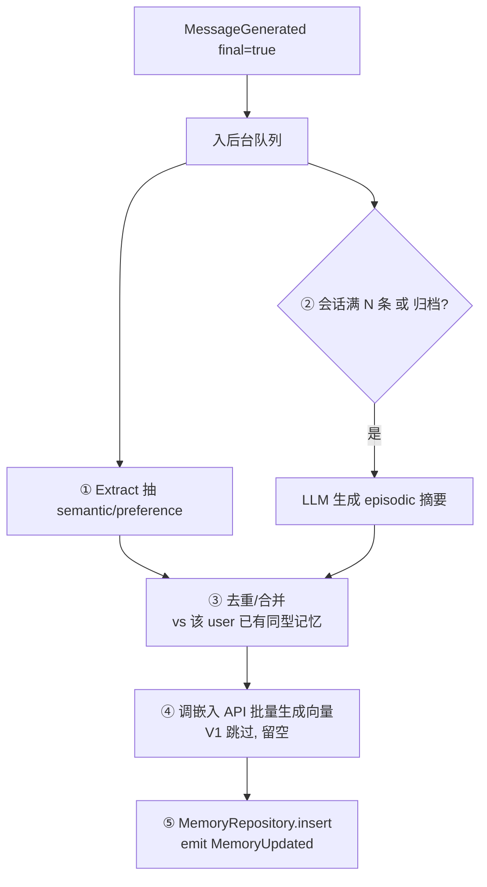
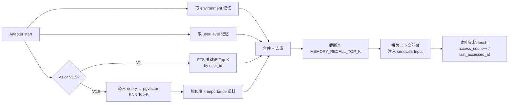

# 06 - 长期记忆设计（Memory Design）

> 展开 [02-架构 §7](./02-Architecture.md) 为可实现的详细设计。表结构见 [04](./04-Data-Model.md)，接口见 [03 §5](./03-Interface-Contracts.md)。
> 定位：让系统**跨会话记住用户与项目**，且**零侵入对话主链路**。
> 落地节奏：**V1 环境快照记忆优先 + 命令式全局记忆** → **V1.5 pgvector 语义召回**（见 [05](./05-Implementation-Plan.md)）。

---

## 1. 设计原则

1. **异步、不阻塞**：记忆的写入（抽取/摘要/嵌入）全部在对话回复之后后台进行，失败重试，绝不拖慢用户收发。
2. **两层解耦**：用户级（跨会话）与会话级（项目内）分离。V1 先做用户显式记忆与环境事实；conversation messages 当前不做完整回放。
3. **可解释、可遗忘**：每条记忆可溯源（`source_message_id`），并带重要度/访问统计，支持衰减清理，避免无限膨胀。
4. **嵌入走 API**：不在 VPS 跑本地模型；批量调用降低成本与延迟影响。

---

## 2. 两层记忆模型

| 层 | 锚点 | `conversation_id` | 内容 | 例 |
|---|---|---|---|---|
| **User-level** | `user_id` | NULL | 稳定画像、跨项目偏好 | "偏好 Bun"、"用中文回答"、"部署在 VPS" |
| **Conversation-level** | `conversation_id` | 填值 | 本项目/任务情节摘要、局部上下文 | "本仓库在重构 auth 模块，已完成 X" |

**V1 注入** = `user-level 全局记忆` + `environment 记忆`，拼为上下文前缀注入新会话。conversation-level 摘要后续用于归档回顾和相关召回，不做完整 messages replay。

> 因为会话按 `cwd` 隔离（[02 §5.1](./02-Architecture.md)），conversation-level 记忆天然按项目分区；user-level 跨项目共享。

---

## 3. 记忆分型

| type | 生成时机 | 生成方式 | 典型内容 |
|---|---|---|---|
| `episodic`（情节） | 会话归档 / 滚动（后续） | LLM 摘要 | "这次会话做了什么、结论是什么" |
| `semantic`（事实） | `/remember` 或环境 upsert | 显式写入 / 系统探测 | "所有软件放在 softs 文件夹"、"当前系统是 Windows" |
| `preference`（偏好） | `/remember` | 显式写入 | "回复用中文"、"默认使用 Bun" |

---

## 4. 写入侧：V1 环境快照 + 命令式记忆

V1 不做隐式抽取，避免误判用户随口表述。写入入口按优先级推进：

- **M8-A 环境快照**：系统启动时 upsert 环境记忆，包含 OS、shell、cwd、default cwd、hostname、Bun 版本、Node/PowerShell/Bash 信息、已接入 CLI、平台路径风格。
- **M8-C 命令式记忆**：`/remember <text>` 直接写入 user-level 持久记忆。
- 后续归档：可生成 conversation-level episodic 摘要，但不回放完整 messages。

环境记忆必须幂等更新，不允许每次启动重复插入同一事实。

## 4.1 后续异步管线（V1.5/增强）



### 4.1 触发与节流
- 仅在 `MessageGenerated { final: true }` 后触发（流式增量不触发）。
- 摘要滚动阈值 `N`（如每 20 条消息或会话归档时），避免每轮都摘要。
- 抽取/摘要用一次 LLM 调用（可复用当前 CLI 或独立轻量模型，V1 可先用规则+启发式，减少成本）。

### 4.2 去重合并
- 新 `semantic/preference` 与该 `user_id` 同型已有记忆比对：
  - V1：文本归一化 + 关键字段匹配。
  - V1.5：向量相似度 > 阈值即视为同一记忆 → 更新而非新增，`importance` 累加。

### 4.3 嵌入（V1.5）
- 批量提交 `content` 到 `EMBEDDING_MODEL`，写回 `embedding`。
- 失败进重试队列，指数退避；**永不阻塞**主链路。
- 维度对齐 `vector(1536)`（`text-embedding-3-small`）。

---

## 5. 召回侧：记忆注入

对话入站、进 CLI 之前插入一个"召回注入"钩子（[02 §4.1](./02-Architecture.md)）。



### 5.1 注入格式（拼进 adapter system prompt 或首轮前缀）
```text
[长期记忆 · 供参考]
- 偏好：回答简洁，用中文
- 项目事实：本仓库使用 Postgres + Drizzle
- 环境：当前运行在 Windows + PowerShell，默认目录 D:/...，路径风格为 Windows drive path
---
（以下为用户本次输入）
{user text}
```

### 5.2 参数
- `MEMORY_RECALL_TOP_K`（默认 6）：注入条数上限，防上下文膨胀。
- user-level 优先保底注入；conversation-level/检索结果补足剩余名额。

---

## 6. 遗忘与衰减

记忆库必须有界，否则召回质量随规模下降。

- **评分**：`score = importance × decay(last_accessed_at) + freq(access_count)`
  - `decay` 随时间指数衰减；越久未访问权重越低。
  - 每次命中 `touch` 提升访问统计，形成"常用记忆浮上来"。
- **清理任务**（定时，V1.5）：
  - 低分且久未访问的 `semantic/preference` → 降权或删除。
  - `episodic` 可二次摘要压缩（多条旧情节 → 一条更高层摘要）。
- user-level 高 `importance` 画像/偏好设保护阈值，不轻易清理。

> V1 记忆量小，可暂不启用清理；随规模增长在 V1.5 引入。

---

## 7. 模块结构（`memory/`）

```text
memory/
├── index.ts          # createMemoryModule({ bus, repos, config })：订阅事件、装配
├── extractor.ts      # semantic/preference 抽取
├── summarizer.ts     # episodic 摘要（滚动/归档）
├── embedder.ts       # 嵌入 API 客户端（批量、重试）—— V1.5
├── recaller.ts       # 召回：FTS(V1) / vector(V1.5) + 重排 + 注入格式化
├── forgetting.ts     # 衰减评分与清理任务 —— V1.5
└── queue.ts          # 后台异步队列（失败重试，隔离主链路）
```

**依赖**：仅 `event/`, `repository/`, `shared/`, `config/`（见 [CLAUDE.md 依赖矩阵](../CLAUDE.md)）。**不依赖 `core/`**——完全通过事件协作，Core 无感知。

---

## 8. 与 Core 的交互（零侵入证明）

| 时机 | Memory 做什么 | Core 是否改动 |
|---|---|---|
| Adapter start | Orchestrator 或装配根调用注入的 `Recaller.recall()` 拿到前缀 | 否（注入接口，非 import 实现） |
| 回复生成后 | Memory 订阅 `MessageGenerated` 后台处理 | 否 |
| 会话归档 | Memory 订阅 `SessionClosed` 生成终摘要 | 否 |

> 唯一"接触"是 Core 在路由时调用一个注入进来的 `Recaller` 接口做召回；实现体在 `memory/`，Core 只见接口。新增/替换记忆策略不动 Core。

---

## 9. V1 vs V1.5 对照

| 维度 | V1 | V1.5 |
|---|---|---|
| 存储 | Postgres（`embedding` 列留空） | 同库启用 pgvector + HNSW |
| 召回 | user-level 取回 + FTS 关键词 Top-K | 向量语义 KNN + 相似度×importance 重排 |
| 嵌入 | 不调用 | API 批量异步回填 |
| 去重 | 文本归一化匹配 | 向量相似度阈值合并 |
| 遗忘 | 暂不启用 | 衰减评分 + 定时清理/压缩 |
| 能力 | "带出用户显式记忆与环境事实" | "语义模糊也能精准召回" |

> **一次定库、分阶段加能力**：数据库第一版即 Postgres；向量作为召回精度增强平滑接入，`MemoryRepository` 接口不变，Core 零改动。
