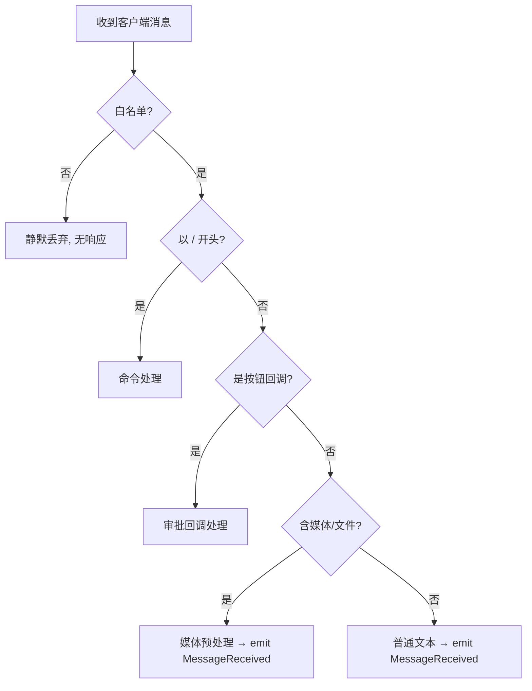

# 07 - 命令与交互 UX（Command & UX）

> Bot 面向用户的**行为契约**：命令、按钮、消息格式、错误文案。实现 Transport 与 Core 路由时以此为准。
> 依赖：会话边界见 [02 §5.1](./02-Architecture.md)，审批见 [PRD §5](./01-PRD.md)，事件见 [03 §1.1](./03-Interface-Contracts.md)。

---

## 1. 消息分类（Transport 入站处理）



- **非白名单**：Transport 层直接丢弃，**不回任何提示**（避免暴露存在性）。
- **命令**：以 `/` 开头，由 Transport 解析后转 Core 对应动作（多数不进 CLI）。
- **命令回复**：所有由 Hub 自己生成的成功、状态、错误和用法消息统一使用 Markdown 卡片；禁止直接发送裸文本。Telegram 转为 MarkdownV2，QQ 使用官方 Markdown 消息。
- **普通文本**：`emit('MessageReceived')`，走会话路由 → CLI。
- **emoji / sticker / 文件**：先做文件预处理。Unicode emoji 做文本归一化；sticker/custom emoji 第一版只解析 metadata；Telegram 可下载附件（`photo/document/audio/voice/video/video_note/animation`；任意普通文件走 `document`，未知来源可归为 `other`）下载到受控目录并记录 metadata/local_path。QQ Bot V1 只接入官方 C2C 文本、流式消息和审批回调键盘，媒体能力后续扩展。只有图片/photo 上传时可立即 OCR；PDF/Word/Excel/text/audio/video 等非图片文件全部懒加载，用户明确要求后才读取、解析、OCR、转写、转换或移动。

---

## 2. 命令清单

| 命令 | 参数 | 作用 | 触发行为 |
|---|---|---|---|
| `/start` | — | 欢迎 + 当前会话状态 | 若无活跃会话则展示引导 |
| `/help` | — | 命令帮助 | 返回本表精简版 |
| `/switch` | `<cli> [path]` | 切换 CLI 会话 | 有未关闭会话则恢复；否则按显式或持久化 cwd 新建；不关闭其他 CLI 会话 |
| `/model` | `[model_name\|model_id]` | 查看或切换当前 CLI 模型 | 当前会话 idle 时先激活；无参数紧凑列出名称，Telegram 提供复制按钮、QQ 以 fenced code block 提供客户端原生复制；带参数按名称/ID 匹配后切换并持久化；无会话时拒绝 |
| `/close` | — | 结束当前会话 | 状态 → `closing` → `SessionClosed{reason:user}` → `closed`；不做非 LLM 自动会话摘录 |
| `/status` | — | 当前会话详情 | 有当前会话时展示完整 conversationId、status、平台、cli/cwd、语言、模型名称/ID 与已存活时间；无会话时展示持久化目标 |
| `/sessions` | — | 列出该用户近期会话 | 历史查看，不表示 resume |
| `/clear` | — | 清空当前会话 | 删除当前 conversation 的 messages、文件映射和受控临时文件；不关闭 conversation，不修改 CLI/模型/用户偏好；文件编号从 1 重新开始 |
| `/reset` | — | 重置当前会话与用户/CLI 偏好 | 在 `/clear` 基础上删除语言、默认 CLI、各 CLI cwd/model 与自动审批偏好；长期 memories 保留 |
| `/audit` | `[conversationId]` | 查看审批审计 | 无参数查看当前会话；带完整或短会话 ID 查看指定会话最近审批记录 |
| `/file` | `<limit> [keyword]` | 查询当前会话文件 | 不传 keyword 时列出最近 limit 条；传入后按文件名模糊匹配；limit 默认 10、最大 50 |
| `/autoapprove` | `[on\|off] [seconds]` | 查看或持久化自动审批 | 默认关闭、5 秒；秒数为 1–300 整数，省略则重置为 5 秒 |
| `/remember` | `<text>` | 写入实例级全局长期记忆 | 默认写入 `semantic`；`preference:` / `偏好:` 前缀写入 `preference`；memory 不关联 conversation/message |
| `/memory` | — | 查看实例级全局长期记忆 | Markdown 列表；每条仅展示短 ID、namespace 与 content |
| `/env` | — | 刷新并查看环境快照 | 重新探测 OS/运行时/PM2/Docker/DB/端口/默认目录/媒体目录；按稳定 `env.*` tag 幂等 upsert |
| `/health` | — | 服务健康检查 | 即时检查 DB ping、默认工作目录、媒体目录、关键 CLI 可用性与进程 uptime；以 Markdown 状态卡片回复；不创建 conversation、不进入 CLI |
| `/update` | `[confirm]` | 受控自更新 | 无参数以 Markdown 预检卡片展示计划；`/update confirm` 汇总各步骤结果而不回传冗长命令输出，并延迟交给守护器重启；新进程启动后主动通知原 chat |
| `/restart` | `[confirm]` | 受控重启 | Windows 上直接拒绝；非 Windows 无参数以 Markdown 预检卡片展示计划；`/restart confirm` 不更新代码，只写入重启通知 marker 并延迟交给守护器重启；用于验证重启与主动通知链路 |
| `/forget` | `<memoryId>` | 删除实例级全局长期记忆 | 支持唯一短前缀；前缀不唯一时拒绝删除；当前用户已启动 adapter 会失效，下一条消息加载最新记忆 |

> 用户目标按 `(platform,userId)` 持久化：语言、当前选中 CLI、自动审批开关及倒计时、每个 CLI 的 cwd/model ID/model name 彼此隔离。首次访问默认 `language=zh`、`default_cli=claude`、`auto_approve_enabled=false`、`auto_approve_seconds=5`，未配置目录时自动使用并创建 `~/ai-workspace/.<cli>`；模型为空表示沿用 CLI 默认。`/switch <cli> [path]` 更新当前选中 CLI；普通消息与 `/status` 读取该目标，`/status` 同时展示模型名称与 ID。当前已接入 `claude` 与 `opencode`。
> 普通文本里的“记住/记一下/记录/remember this”等自然语言记忆请求不是 `/remember`：它不会直接写入 global 记忆，也不会进入 Claude SDK；系统会按 `MEMORY_REQUESTED_SUMMARY_MESSAGE_LIMIT` 读取当前 conversation 最近的 user/assistant 消息调用配置的记忆 LLM 摘要，摘要语言跟随持久化的 `/lang` 偏好，长度上限由 `MEMORY_SUMMARY_MAX_CHARS` 控制，并要求第三人称或中性事实陈述，写入 conversation-derived episodic 记忆并用于后续 embedding 召回。

---

## 3. 会话边界与命令的关系

| 用户动作 | 会话结果 |
|---|---|
| 普通发消息 | 命中 `(platform,user,selectedCli)` 的未关闭会话则复用；否则按该 CLI 持久化 cwd 新建 |
| `/switch <cli> [path]` | 恢复该 CLI 的未关闭会话；不存在时创建 `idle` 会话。显式 path 仅在新建时持久化；与已有会话 cwd 冲突时拒绝 |
| `/model [model_name\|model_id]` | 仅使用当前 CLI 未关闭会话；idle 会话激活为 running。无参数显示模型名称，Telegram 按钮复制规范 ID、QQ 将规范 ID 放在 fenced code block 供原生复制；带参数按唯一名称或 ID 切换并保存名称+ID；不创建新会话 |
| `/close` | 当前会话关闭；不自动写长期记忆，下条消息将开新会话 |
| 长期无活动 | 超 `SESSION_ARCHIVE_DAYS` 自动归档（等同 `/close`，`reason:archiveTimeout`） |

---

## 4. 审批交互（Human-in-the-loop）

### 4.1 展示（`ApprovalRequested` → `sendApproval`）

Markdown 卡片 + 内联按钮：

```text
⚠️ *需要授权*

命令：
`rm -rf ./dist`

说明：Claude 请求执行上述操作。

[ ✅ Approve ]   [ ❌ Reject ]
```

- 卡片携带 `approvalId`（按钮 callback data 内），供回调定位。
- 审批是运行时状态：conversation 持久状态保持 `running`，pending approval 只存在于 adapter/orchestrator 内存和后续 audit 记录中。
- Claude/OpenCode 共用同一套保守只读 shell 策略：POSIX/cmd/PowerShell 的单条查询（如 `ls`、`rg`、`git status`、`dir`、`Get-ChildItem`、`Get-Content`、`Test-Path`、`docker inspect`、`docker volume ls`）直接执行；只有把 stderr 丢到 `/dev/null` 的 `2>/dev/null` 不算写入，具名文件重定向仍审批。管道、串联和命令替换会递归检查每个叶子；`find -delete/-exec`、文件写入、未知命令及不确定命令仍进入审批。OpenCode 对安全 `bash` permission 直接回复 `once`，不生成审批卡。
- `/autoapprove on [seconds]` 时卡片仅保留“拒绝本轮”：orchestrator 按该用户持久化的 1–300 秒倒计时；Telegram 每秒编辑同一消息显示剩余时间，QQ 静态显示配置秒数；到期统一发 `ApprovalApproved{automatic:true}`，并另发自动批准结果通知。省略秒数会写回默认 5 秒。
- 倒计时期间点击拒绝会取消定时器，并沿用 `interrupt + reject + stop adapter` 中断当前整轮；持久化开关不变，下一轮仍继续自动审批。

### 4.2 回调处理

| 点击 | 事件 | 应答 | 后续 |
|---|---|---|---|
| Approve | `ApprovalApproved` | `resolveApproval(id,'approve')` | 记审计 → adapter 继续 |
| Reject | `ApprovalRejected` | `interrupt()` + `resolveApproval(id,'reject')` | 记审计 → 当前轮停止 |

> **应答语义按家族分派**（对上层透明）：SDK 家族 → `resolve({behavior:'allow'|'deny'})`；PTY 家族 → 注入 `y\r` / `n\r` 或 `interrupt()`（Ctrl+C）。

- **幂等**：同一 `approvalId` 重复点击只生效一次（按 `approvalId` 去重），并把卡片 `editMessage` 为最终结果（禁用按钮）。
- 每次手动或自动决策都**强制**写 `audit_logs`（时间/操作人/命令/决策）；自动批准的 operator 为 `auto:<userId>`。
- `/audit [conversationId]` 可查看最近审批记录；只能查看当前用户自己的会话。审计覆盖手动与自动 Approval，不记录普通命令或消息。

### 4.3 卡片终态回显
```text
⚠️ 需要授权 — ✅ 已批准（by @user, 14:23）
命令：`rm -rf ./dist`
```

---

## 5. 流式回复呈现

- CLI 输出经 Aggregator 聚合后 `MessageGenerated` → Transport `editMessage` 增量刷新同一条消息。
- 超单条上限（TG 4096 字符）自动拆成多条。
- `final:false` 增量编辑，`final:true` 定稿并停止刷新。

---

## 5.5 媒体与 emoji 入站

| 类型 | 第一版处理 | 是否 OCR |
|---|---|---|
| Unicode emoji | 从文本中识别 emoji，补充 short name/keywords 到上下文 | 否 |
| Telegram sticker/custom emoji | 解析 `emoji`、`set_name`、`custom_emoji_id`、`is_animated`、`is_video`、`file_id` 等 metadata | 否 |
| 图片/photo | 下载到受控目录，记录 metadata；调用 `OcrProvider`，配置 `OCR_API_BASE_URL` 后走 Light OCR `POST /ocr/file` | 是 |
| PDF/扫描 PDF | 上传时只暂存；`@readN` 时由轻量 `pdf-to-img` 最多渲染 `media.pdfMaxPages` 页为临时 PNG，再逐页调用现有 OCR，完成后立即删页图 | 按需 |
| Word/Excel 文件 | 上传时只暂存；`.docx` 在 `@readN` 时用 `mammoth`，旧 `.doc` 不支持；Excel 不解析，需用 `@fileN` 交给 AI 的外部文件能力 | Word 按需 |
| 文本文件 | 下载并记录 metadata/local_path；上传时不读取正文、不作为本轮上下文 | 否 |
| 其它普通文件 | 作为 `document` 或 `other` 保存到受控目录，记录 metadata/local_path；不做自动处理 | 否 |
| 音频/语音/video/animation | 下载到受控目录，记录 metadata；暂不做转写或内容理解 | 否 |
| 动态/video sticker | 第一版只记录 metadata；Vision/抽帧暂不实现 | 否，属于后续 Vision |

> 上传文件不等于处理文件。图片（含 Telegram 同一 `media_group_id` 相册中的多图）会循环 OCR；其他文件只暂存并返回会话内编号，不进入 AI prompt。后续用 `@readN` 显式读取并注入正文，或用 `@fileN` 只把本地路径交给 AI。`/clear`、`/reset`、`SessionClosed` 都会删除该会话映射与受控临时文件并重置编号。动态 sticker 的画面含义仍属于后续 Vision。

文件映射不保存平台临时下载 URL。Telegram 仅保存稳定的 `file_unique_id` 到统一 `file_id` 字段；QQ 没有
等价稳定标识时该字段为空。Telegram long polling 意外断开后由 Transport 以 2–60 秒指数退避自动重连，
无需依赖进程重启消费积压消息。

---

## 6. 错误与边界文案（用户可见）

| 场景 | 文案 |
|---|---|
| 非白名单 | （无响应） |
| CLI 启动失败 | ⚠️ 无法启动 {cli}，请稍后重试（详情见日志） |
| 待审批时发普通消息 | ⏳ 当前有操作等待授权，请先 Approve / Reject |
| `/remember` 缺少内容 | 用法：/remember <要长期记住的事实或偏好> |
| `/forget` 缺少 ID | 用法：/forget <memoryId> |
| `/forget` 前缀不唯一 | 记忆 ID 前缀不唯一：`{prefix}` |
| `/remember` 或 `/forget` 后继续对话 | 下一条普通消息自动重启 adapter 并注入最新全局记忆，conversation 不关闭 |
| `/env` 执行 | 立即刷新环境快照并返回 `env.*` 记忆；probe 失败项显示 `missing` 或 `unknown`，不阻塞服务 |
| `/health` 执行 | 返回 live self-check；关键检查失败时 Status 为 `down`，非关键检查失败时为 `degraded` |
| `/update` 执行 | Windows 上直接返回“自更新不可用”且不执行命令；非 Windows 无参数返回预检计划；必须发送 `/update confirm` 才执行；Claude SDK 平台包由本地 stub 在安装解析阶段覆盖，不会下载；工作树不干净或任一步失败时停止且不安排重启 |
| `/update confirm` 成功 | 返回精简 Markdown 汇总，并在 `UPDATE_RESTART_DELAY_MS` 后执行 `UPDATE_RESTART_COMMAND` + `UPDATE_RESTART_ARGS`；重启前写入 `UPDATE_RESTART_NOTICE_FILE`。通知 marker 仅在主动消息发送成功后删除；启动期发送失败会重试，避免丢失通知。 |
| `/restart` 执行 | Windows 上直接返回“重启不可用”且不执行命令；非 Windows 无参数返回重启预检计划；必须发送 `/restart confirm` 才执行；不执行 git pull、依赖安装、迁移或检查 |
| `/restart confirm` 成功 | 返回 Markdown 重启安排，并在 `UPDATE_RESTART_DELAY_MS` 后执行同一组 `UPDATE_RESTART_COMMAND` + `UPDATE_RESTART_ARGS`；重启前写入 `UPDATE_RESTART_NOTICE_FILE`，新进程启动后主动通知原 chat；marker 仅在发送成功后删除。 |
| adapter 重启后继续同一会话 | 下一条 user message 会携带当前 conversation 最近 `RECENT_CONTEXT_LIMIT` 条历史消息；单条超长时按 `RECENT_CONTEXT_MESSAGE_MAX_CHARS` 保留尾部，避免丢失上一轮最新结论 |
| CLI 运行中 `/switch opencode` | 🔄 已切换 CLI；原 CLI 会话保持未关闭，可随时切回 |
| 进程被空闲回收后发消息 | （静默唤醒，重启进程，用户无感）|
| 内部异常 | ⚠️ 出错了，已记录。可重试或 /status 查看状态 |

> 用户可见文案友好简洁；技术细节只进 Pino 日志与 `ErrorOccurred` 事件。

---

## 附：`settings.json`

`settings.json.example` 是提交到仓库的完整嵌套 JSON 模板，实际值写入已 gitignore 的 `settings.json`。

```bash
# 首次创建，或在更新后对齐新增/删除的 key
bun run setting:migrate

# 交互式查看和编辑
bun setting
```

`setting:migrate` 只在 `settings.json` 与 `settings.json.example` 之间对齐结构：保留现有值、补新 key、删旧 key。它不读取 `.env`。`/update confirm` 也会在数据库迁移前自动执行该命令。

`session.claudeExecutablePath` 可填写系统 Claude CLI 的绝对路径；留空时从 `PATH` 自动查找。根 `package.json` 为 Agent SDK 声明的每个平台 CLI 包配置同名本地 stub override，因此普通 `bun install` 只安装 SDK JS 控制层，不下载原生 Claude CLI。PDF 仅在 `@readN` 时通过 `pdf-to-img` 临时渲染，默认最多 20 页、scale=2。
