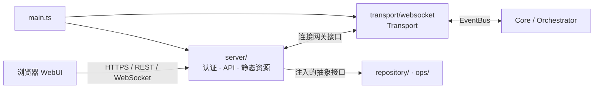

# 08 - Web Control Plane 任务书

> 状态：W3 完成，准备实施 W4。
> 范围：将单用途 HTTP 出站模块演进为 Hub 的 Web 后端服务，并交付单管理员 WebUI。

---

## 1. 目标与非目标

现有 `transport/http` 只提供两个出站接口，不能承载浏览器登录、实时聊天、流式输出、工具审批或配置管理。本任务交付一个单管理员 Web Control Plane：统一 HTTP API、WebSocket、WebUI 静态资源，并保留既有 HTTP API。

首期不是多租户 SaaS：不做注册、角色权限、OAuth、多浏览器协作、离线消息、PWA、配置热重载或完整审计后台。

## 2. 已确认决策

| 主题 | 决策 |
|---|---|
| 管理员模型 | 单一管理员，以现有 `http.authToken` 登录 WebUI。 |
| 后端边界 | 新建 `src/server/` 承担 Bun HTTP/WebSocket/静态资源/认证，替代旧 HTTP transport 的服务职责。 |
| 聊天接入 | 新建 `transport/websocket` 实现 `Transport`，经 EventBus 收发；`server/` 不直接调用 Core。 |
| 前端 | 原生 TypeScript + Web Components + Tailwind CSS；不使用 React/Vue 等运行时框架。 |
| 样式工具 | `tailwindcss`、`@tailwindcss/cli`、`prettier-plugin-tailwindcss`；Prettier 仍是唯一格式化入口。 |
| 配置生效 | `SettingsJsonSchema` 校验、原子写入；保存后必须显式受控重启，不做热重载。 |
| 敏感数据 | API 永不回传 token/password/secret 明文；只显示“已配置”，可显式覆盖。 |
| Web 偏好 | 语言、主题、强调色仅保存于浏览器本地，不写服务器业务配置。 |

## 3. 架构边界

- `server/` 只依赖 `config/`、`event/`、`shared/` 和 Composition Root 注入的抽象；不得 import Core 内部、具体 CLI 或 Drizzle。
- `transport/websocket` 按现有 `Transport` 契约处理白名单、入站 `MessageReceived`、出站流式消息和审批事件。
- `main.ts` 是 server、websocket transport、repositories 与运维能力的唯一装配点。
- 设置文件读写与 schema 校验收敛在 `config/` 的受控能力中；HTTP handler 不直接操作 SQL。

## 4. 后端服务

### 4.1 认证与安全

- `POST /api/auth/session` 校验 Bearer Token，建立短期内存会话，返回 `HttpOnly`、`SameSite=Strict` Cookie；Token 不写入 `localStorage`。
- `DELETE /api/auth/session` 登出并失效会话。
- `/api/*`（健康检查除外）和 `/ws` 均要求认证；兼容接口保留 Bearer Token 支持。
- 对外绑定必须置于 HTTPS 反向代理之后；生产 Cookie 使用 `Secure`。
- 限制来源、请求体、WebSocket 连接数和帧大小；日志不记录 Token 或敏感配置明文。

### 4.2 API 与协议

保留 `GET /health`、`POST /api/platform-msg`、`POST /api/session-msg`。新增会话/运行状态、配置分类读取与保存、重启预览与确认、静态资源与 SPA fallback。

所有新增接口必须先补入 [接口契约](./03-Interface-Contracts.md)，明确请求、响应、权限和失败码。WebSocket 使用带版本和 `type` 的 JSON 信封：

- 上行：聊天输入、命令、审批决定、会话切换。
- 下行：连接状态、会话更新、流式 delta/final、审批请求/倒计时/结果、可恢复错误。
- 断线采用指数退避重连；重连后重新获取会话快照，不信任旧客户端内存。

## 5. WebUI

### 5.1 功能

| 页面 | 首期能力 |
|---|---|
| 登录 | Token 输入、连接状态、HTTPS 提示；不持久化 Token。 |
| 聊天控制台 | 会话切换、CLI/模型/CWD、流式回答、命令、工具状态、审批卡与自动审批倒计时。 |
| 会话抽屉 | 现有会话的查看、切换、创建、关闭语义。 |
| 配置 | 14 个现有分类、字段说明、脱敏、校验、保存和重启确认。 |
| 外观 | 中文/English、system/light/dark、强调色切换。 |

### 5.2 视觉与可访问性

视觉采用“深色精密控制台”，不用通用卡片式 SaaS：石墨/深蓝为基底，强调色只用于关键操作和状态；工具调用、审批、回答保持明确层级。浅色主题保持同一信息结构，不是简单反色。

- CSS custom properties 定义设计令牌，Tailwind utilities 消费令牌。
- 使用系统中文 UI 字体与等宽代码字体，不依赖外网字体。
- 动效仅用于载入、流式消息、保存、倒计时和抽屉，并尊重 `prefers-reduced-motion`。
- 键盘可达、焦点可见、语义化表单、足够对比度；错误不可只用颜色表达。

### 5.3 多端、语言与主题

| 视口 | 布局验收 |
|---|---|
| ≥1280px | 三栏：会话导航 / 聊天主区 / 上下文与审批检查器。 |
| 768–1279px | 两栏；检查器进入抽屉，会话栏可收起。 |
| <768px | 单栏聊天；会话、审批、设置为可关闭抽屉；软键盘不遮挡输入或关键审批操作。 |

最小 320px 不溢出，触控/鼠标/键盘均可用，不能只依赖 hover。

- 国际化：`zh-CN` 与 `en`；可见静态文本、错误、空状态、相对时间和 aria 标签全部走字典。默认跟随浏览器，切换后恢复。
- 主题：`system`、`light`、`dark`，即时生效并恢复。
- 强调色：至少 `cyan`、`emerald`、`amber`、`rose`、`violet`；仅替换语义强调 token，不改变成功/警告/错误语义。

## 6. 里程碑与验收

### W0 — 视觉系统、跨端界面骨架与契约

先增加 Tailwind、Prettier 插件、CSS/JS 构建脚本与产物忽略规则；再建立设计令牌、三种主题、五种强调色、双语字典、响应式布局和组件边界。使用 mock 状态完成登录、控制台、会话抽屉、审批检查器和设置页的可交互骨架，再定义 server、WebSocket、WebUI 契约。

验收：从 320px 到桌面三栏均可用；主题、强调色和语言可即时切换且刷新恢复；Tailwind class 排序稳定；前端可由 Bun 构建；原有检查无回归。

### W1 — Server Foundation 与认证

抽取兼容 API，建立 `server/`、认证会话、静态资源与统一错误。验收：旧接口行为不变，未认证 API/WS 被拒绝，敏感配置不出现在响应或日志。

### W2 — WebSocket Transport 与聊天闭环

实现浏览器 transport、协议、断线恢复、聊天与审批映射，并将 W0 的响应式控制台接入真实状态。验收：网页完成流式对话、命令、审批同意/拒绝，且不会与 Telegram/QQ 会话串路。

### W3 — 设置与受控重启

实现脱敏配置读写、服务端校验、原子保存、重启预览/确认。验收：非法配置不落盘；敏感值只可覆盖不可读取；保存后明确显示重启状态。

### W4 — 体验收口与跨端回归

基于真实数据完成 loading/empty/error 等状态、键盘与触控细节、可访问性、弱网重连和多端回归；不得把布局、主题、强调色或国际化留到本阶段才首次实现。验收：320px、768px、1280px；中英文案完整；三种主题与五种强调色均通过真实功能回归。

### W5 — 回归、文档与部署

补单元/集成测试，更新架构、接口、命令 UX、设置模板、README 与 HTTPS 反向代理示例。验收：format、typecheck、lint、相关测试通过，VPS HTTPS 真机回归完成。

## 7. 完成定义

管理员能通过 HTTPS WebUI 登录，在任意目标设备实时聊天、查看并处理审批、安全编辑配置、切换中英文/主题/强调色，且 Telegram、QQ 与既有 HTTP API 无回归时，本任务完成。
